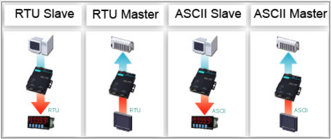

# mbgate

### Overview

* The MGate Modbus gateways, respectively, that convert between Modbus TCP, ASCII, and RTU communication protocols.
* The gateways provide both serial-to-Ethernet communication and serial(Master)-to-serial(Slave) communication.
* In addition, the gateways support simultaneously connecting serial and Ethernet masters with serial Modbus devices.
* The MGate gateways can be accessed by up to 16 TCP master/clients or connect to up to 32 TCP slave/servers.
* Routing through the serial ports can be controlled by IP address, TCP port number, or ID mapping.
* A featured priority control function allows urgent commands to obtain an immediate response.

Mode | Description | Status
------------ | ------------- | -------------
RTU Slave | Modbus RTU slave(s) will be connected to the serial port
RTU Master | A Modbus RTU master will be connected to the serial port | Almost done
ASCII Slave | Modbus ASCII slave(s) will be connected to the serial port
ASCII Master | A Modbus ASCII master will be connected to the serial port

Todo list:
- [x] Simple communication
- [x] External configuration file
- [ ] Multiprocessing to use many serial ports

Tested on raspberry pi B+
